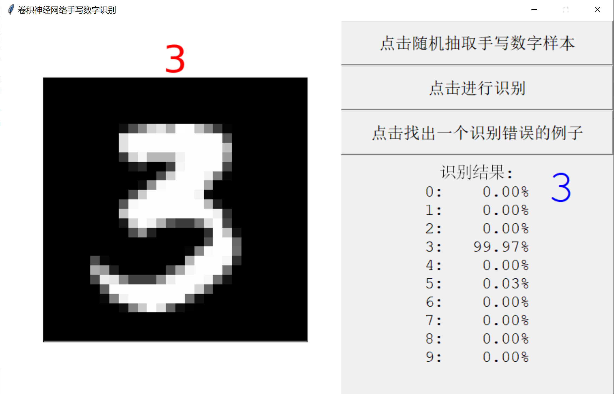
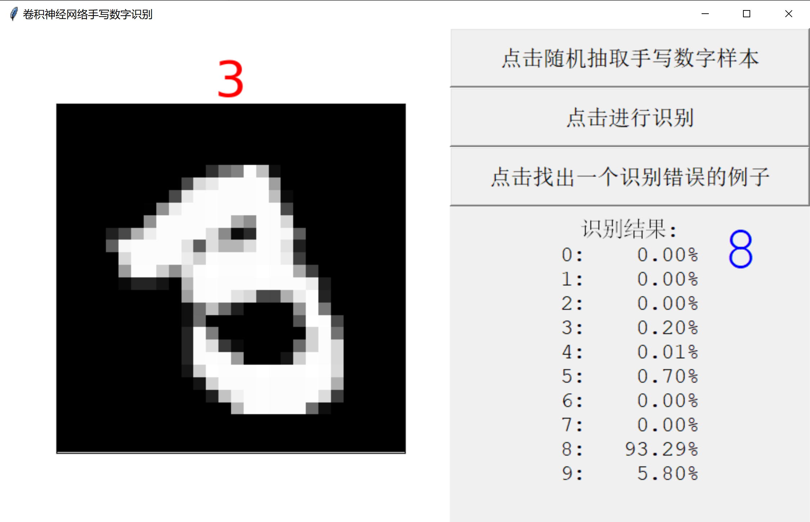

# MNIST Classification with CNN
A simple pytorch implementation of CNN on MNIST dataset.

——By Chaoran Cheng

19.12.7


The `cnn.py` implemented a simple CNN with pytorch. The network consists of two convolutional-ReLU-pooling layer and a fully-connected-softmax layer. The network structure is as following:

```python
class Net(torch.nn.Module):
    '''
    两层神经网络，输入层为28*28，即每张图片大小，
	隐藏层包含hidden个神经元和一个ReLU层，
    输出层为10个（即十个数字分别的权值），采取全连接
    '''

    def __init__(self):
        super(Net, self).__init__()
        self.conv1 = nn.Sequential(
            nn.Conv2d(in_channels=1, out_channels=16,
			 kernel_size=5, stride=1, padding=2),
            nn.ReLU(),
            nn.MaxPool2d(kernel_size=2)
        )
        self.conv2 = nn.Sequential(
            nn.Conv2d(16, 32, 5, 1, 2),
            nn.ReLU(),
            nn.MaxPool2d(2)
        )
        self.out = nn.Linear(32 * 7 * 7, 10)

    def forward(self, x):
        '''
        变量在神经网络中的传递
        :param x: 输入数据
        :return: 输出权值
        '''
        x = self.conv1(x)
        x = self.conv2(x)
        x = x.view(x.size(0), -1)
        output = self.out(x)
        return output

```

Hyperparameters are set to `EPOCH = 3, BATCH_SIZE = 64, LR = 0.001`. Training is taken on the whole dataset with 60000 training samples. It takes only a minute to reach over 90% accuracy. The trained model is saved to `cnn.pt`.

The `cnn_test.py` implemented a visualized evaluation of the trained network using Tkinter. The results are as following:

<center><figure><figcaption><b>Fig. 1</b> A correctly-classified example</figcaption></figure></center>

<center><figure><figcaption><b>Fig. 2</b> An incorrectly-classified example</figcaption></figure></center>

Note both codes will first download the MNIST dataset using torchtext.